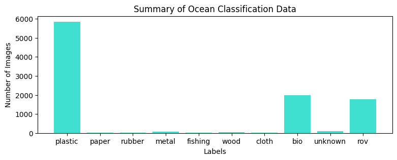

# Ocean Trash Detection
Project for machine learning graduate coursework in Spring 2022.

Our project's goal was to train a machine learning algorithm to detect trash from flora and fauna in the ocean. This recognition task fuels our two main motivations.  

Number one, to provide a proof-of-concept for the automation of clean-up of trash in the ocean. If trash can be accurately indentified we forsee that machinery equipped with these identification models may be used to collect and recycle trash. 

Identifying types of ocean trash aids in the understanding of pollution patterns. These analytics may be used by educational programs for industry and consumers, to promote proper disposal and foster behaviors for a cleaner ocean. Additionally, awareness of common trash types facilitates targeted recycling programs, optimizing efforts for environmental preservation.

## Data Preparation
Training images were extracted and underwent pre-processing tailored to enhance their traits and quality.

### Dataset Background
The trash dataset originates from the University of Minnesota consisting of underwater video's taken by ROV's (Remotely Operated Vehicle). Through these video data 5,700 images were extracted each containing labeled bounded boxes of flora, fauna, ROVs and/or different types of trash. 

### Image Collection
We extracted the sub-images within the original 5,700 to give us a dataset of over 14,000 images. As images are are taken from video many images, though unique, are often similar to one another. For example a fish swimming across the landscape of the video or a piece of trash being suspended right above the seafloor. 

### Image Manipulation
Initially, we observed that our images shared a homogenous nature. Being captured from the ocean floor, they all possessed a similar color filter. Moreover, the limitations of underwater camera technology result in less clear images, causing the outlines of objects or biological elements to blur. Theis decreased clarity would pose challenges for a machine learning algorithm to accurately identify these items.

An experiment in recognizing emotions in facial expressions prepared images for training by applying several types of distortion (2022, Fulton). In a similar approach we applied contrast adjustments and color inversion to our images to solve our forseeable problems. 

## Experiments
We conducted a dense neural network experiment as our baseline for training, with a primary emphasis on convolutional neural networks.

### Dense Neural Network

### Convolutional Neural Network

## Results 

## Discussion
In summary, the CCNN demonstrated superior performance over the DNN in terms of accuracy. However, both CNN and DNN appeared to overfit on the original image data. Noticeably, training with contrasted and inverted images yielded better results than using regular images alone. Our top-performing model exhibited a high recall rate for plastic but a lower precision, indicating potential overfitting in the case of plastic trash classification.

## References
Fulton, Michael S; Hong, Jungseok; Sattar, Junaed. (2020). Trash-ICRA19: A Bounding Box Labeled Dataset of Underwater Trash. Retrieved from the Data Repository for the University of Minnesota, https://doi.org/10.13020/x0qn-y082.

Pitaloka, D., Wulandari, A., Basaruddin, T. and Liliana, D., 2022. Enhancing CNN with Preprocessing Stage in Automatic Emotion Recognition.